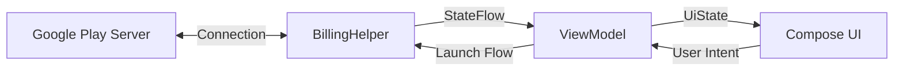

# Valhalla Billing V8 🛡️

> **A ruthless, production-ready implementation of Google Play Billing Library 8.3.0.**

This project implements a clean, reactive architecture for handling Android subscriptions and one-time purchases without the spaghetti code usually found in billing tutorials.

## 🏛️ Architecture

We use a unidirectional data flow. The `BillingHelper` acts as the single source of truth, emitting state updates via `StateFlow` to the ViewModel, which the UI observes.



## 🚀 Setup Checklist (The Ruthless Protocol)

**CRITICAL WARNING:** 99% of "Item Unavailable" errors occur because developers skip steps 3, 4, or 5. **Do not skip them.**

* [ ] **1. Product IDs:** Ensure IDs in `BillingHelper.kt` match your Play Console exactly.
* Default: `premium_sub` (Subscription)
* Default: `premium_user` (One-Time)


* [ ] **2. Signed Build:** You **MUST** sign your APK/AAB with your **Release Keystore** (or the specific debug key uploaded to the Console). The default Android debug key will fail.
* [ ] **3. Internal Track:** Upload your build to the **Internal Testing** track on the Play Console.
* [ ] **4. Testers List:** Add your Gmail address to the testers list in the Console.
* [ ] **5. Accept Invite (CRITICAL):** Copy the "Join on Web" link from the testers tab, open it on your phone, and click **ACCEPT INVITE**.
* [ ] **6. License Testing:** Go to *Setup > License Testing* in the Console and add your email. Set the response to `RESPOND_NORMALLY`.

## 💻 Integration Guide

### 1. Dependency Injection (Koin)

Inject the `BillingHelper` as a singleton. It manages its own lifecycle and connection retry logic.

```kotlin
val appModule = module {
    // Singleton Billing Client
    single { BillingHelper(androidContext()) }
    
    // ViewModel Injection
    viewModel { SubscriptionViewModel(get()) }
}

```

### 2. ViewModel Usage

The `BillingHelper` exposes hot flows (`productDetailsList`, `activeSubsList`). Merge them into a generic `UiState` in your ViewModel.

```kotlin
class SubscriptionViewModel(helper: BillingHelper) : ViewModel() {
    
    val uiState = combine(helper.productDetailsList, helper.activeSubsList) { products, purchases ->
        // Map to your UI state
    }.stateIn(viewModelScope, SharingStarted.WhileSubscribed(5000), SubscriptionUiState())

    fun buy(activity: Activity, product: ProductDetails) {
        helper.launchPurchaseFlow(activity, product)
    }
}

```

### 3. Handling Acknowledgment

Purchases are automatically acknowledged in `BillingHelper.processPurchases()`.

> [!CAUTION]
> If you remove the acknowledgment logic, Google will automatically refund the user after **3 days**.

## 🔧 Troubleshooting

| Error | Cause | Fix |
| --- | --- | --- |
| **Billing Unavailable** | Wrong build variant | Use a Signed Release build or add your debug key to the Console. |
| **Empty Product List** | User not a tester | **Accept the Invite** via the web link in the Internal Testing tab. |
| **Feature Not Supported** | Emulator issue | Use a physical device or an Emulator image with "Google Play Store" icon. |

## 🤝 Contributing

Pull requests are welcome. For major changes, please open an issue first to discuss what you would like to change.

## 📝 License

[MIT](https://choosealicense.com/licenses/mit/)

Then, do the **Setup Checklist** on the Play Console. That is where the real battle begins. Do not come back to me saying "list is empty" until you have clicked that "Accept Invite" link.

```
